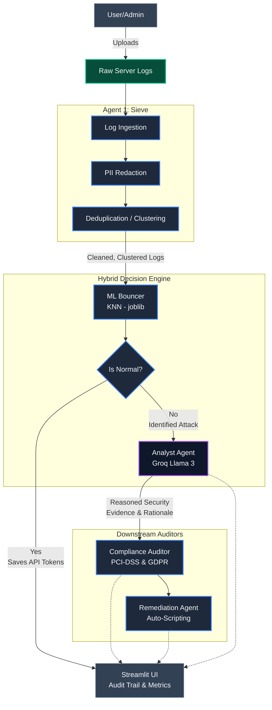

# Architecture Overview

This diagram logs the end-to-end flow of TraceBack Sentinel, from raw ingestion to remediation.

## Technical Breakdown

### 1. The Sieve Pipeline
The **Sieve Agent** handles pre-processing. Since logs often contain sensitive data, we can't just pipe them straight to an external LLM.
- **PII Scrubbing**: Strips IP addresses, UUIDs, and credentials using regex and replaces them with tokens (e.g., `[REDACTED_IP_0]`).
- **Log Clustering**: Brute-force attacks can generate thousands of identical logs. Sieve clusters these into representative strings with a hit counter, reducing the payload size before it reaches the cloud.

### 2. The ML Bouncer
This is our primary cost-control mechanism. It's a `KNeighborsClassifier` (KNN) trained on the **NSL-KDD dataset**.
- It extracts 41 mathematical features from the logs.
- If it classifies a log as `Normal` with high confidence, the pipeline stops there.
- This prevents unnecessary calls to the Groq API, cutting token costs by ~90%.

### 3. Analyst Agent (LLM)
If the Bouncer flags traffic as a threat (DoS, Probe, U2R, etc.), the log is sent to the Groq Llama 3 model.
- **Structured Logic**: The analyst identifies the specific **Evidence** and provides a **Rationale**.
- **MITRE Mapping**: Every event is tagged with a standard MITRE ATT&CK technique (e.g., T1190).

### 4. Risk & Compliance
After classification, two specialized agents take over:
- **Compliance Auditor**: Links the threat to specific regulations like **PCI-DSS Requirement 10** or **GDPR Article 32**.
- **Remediation Agent**: Generates actionable scripts (`nginx.conf`, `.sh`) to block the detected attack vector.

### 5. Streamlit Dashboard
The UI serves as the orchestrator:
- **Traceability**: Shows the ML Confidence vs. LLM Rationale side-by-side.
- **Business Impact**: Real-time stats on financial risk and downtime.
- **Hot-Patching**: Simulates a "Deploy Architecture Patch" to show how the system would react in a real environment.

## Resilience & Fail-safes
- **API Fallbacks**: If Groq is down or rate-limited, the system falls back to cached responses or a "Safe Mode" output.
- **Prioritizing Security**: If the ML Bouncer fails to parse a log, we default to full LLM analysis. We'd rather pay for a token than miss an attack.
- **Deduplication**: Malformed lines are skipped to prevent the whole batch from failing.
- **Privacy**: No logs are saved to disk. Everything is ephemeral and wiped once the session ends.

