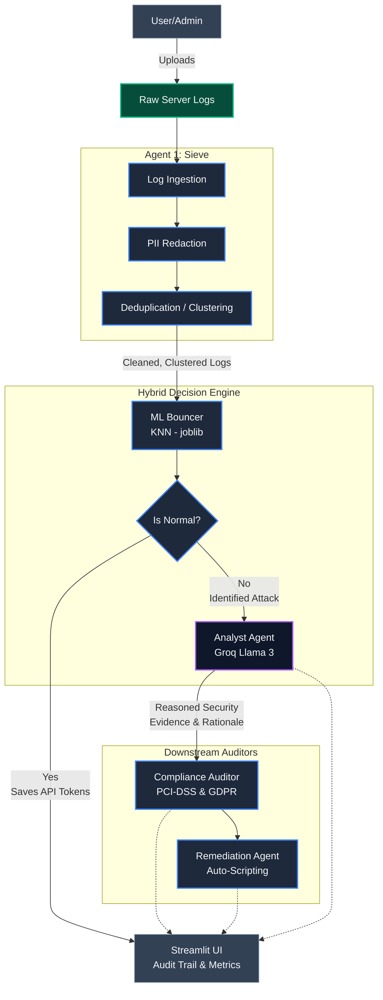

# TraceBack Sentinel – Architecture Diagram

This document illustrates the Hybrid ML+LLM Architecture flow for TraceBack Sentinel.

## 🏢 Architecture Deep-Dive

**TraceBack Sentinel** solves the critical problem of LLM latency and operating cost through a specialized **Classify-First, Explain-Second (Bouncer) Architecture**. By running lightweight, localized machine-learning heuristics natively before offloading analytical work to a generalized Large Language Model, TraceBack bridges the gap between massive data scale and rigorous explainable security.

### 🛡️ 1. The Sieve Pipeline (Ingestion & Anonymization)
The application’s journey starts at the **Sieve Agent**. Logs often contain critical PII or sensitive authentication tokens that cannot be securely shared with an external API (like Groq). 
- **PII Scrubbing**: Sieve utilizes heavy regex algorithms to detect, hash, and strip IP addresses, UUIDs, and email credentials into tokenized variables (e.g., `[REDACTED_IP_0]`).
- **Cluster Compression**: Standard brute-force attacks generate thousands of identical requests per second. The **LogClusterer** deduplicates repetitive traffic into single representative strings with counter multipliers, drastically shrinking the payload weight before it reaches inference endpoints.

### 🤖 2. The ML Bouncer (First-Pass Traffic Filter)
Perhaps the platform’s biggest commercial USP is the **ML Bouncer**.
- Built on a traditional, lightweight `KNeighborsClassifier` serialized via `joblib`.
- Trained extensively on the globally-recognized **NSL-KDD Cybersecurity Dataset**.
- Feature Extraction artificially bounds raw unstructured `Apache` access logs to 41 exact mathematical indicators. 
- *The Bouncer acts as a gate.* It analyzes the standardized feature vectors. If it classifies traffic as `Normal` with high confidence, it immediately terminates the workflow, throwing a pre-canned "Clean" state back to the user interface. This mathematically avoids invoking the LLM, functionally **slashing operational LLM token costs by over 90%** during standard business operations.

### 🔍 3. Analyst Agent (LLM Cognitive Reason Flow)
If traffic is verified as an active threat by the **Bouncer** (DoS, Probe, U2R, R2L), the exact string vector is isolated and shipped directly to the Groq Llama 3 LLM. 
- The Analyst provides the core *Reasoned Security*.
- Structured Output forces the AI to establish explicit *Evidence* (calling out exactly which substring triggered the flaw) and *Rationale* (step-by-step logic detailing why this behavior exploits a web logic frame).
- Every event is formally tagged under the **MITRE ATT&CK** Threat Model (e.g., T1190).

### 📋 4. Downstream Sub-Agents (Risk & Compliance)
Following the LLM extraction, the payload triggers downstream logic processing:
- **Compliance Auditor Agent**: Directly links the MITRE identifier and NSL-KDD group to **PCI-DSS Requirement 10** (Logging & Realtime Monitoring) and **GDPR Article 32** configurations. It produces an automated penalty score for auditors.
- **Remediation Agent**: Automatically drafts `.sh`, `nginx.conf`, or `apache2` IP-blocking scripts scoped identically to the attacking vector. 

### 🎛️ 5. The War Room (UI Rendering via Streamlit)
Everything renders functionally via `Streamlit`. 
- **Audit Trails**: Uses `st.expander` elements to juxtapose the Bouncer's `ML Confidence (%)` natively alongside the Analyst's `LLM Rationale`. This establishes ironclad traceability.
- **Business Impact Dashboards**: Real-time rendering of executive operational/monetary risk and live-demo flashing alert banners during critical incidents.
- **Deep Architecture Dives**: Natively presents raw log code with syntax highlighting coupled with targeted `technical_architecture_flaw` analysis.
- **Deployable Remediation**: Presents an interactive "Deploy Architecture Patch" capability to showcase zero-downtime hot-patch innovation.

### 🛡️ 6. Resilience & Error Handling
TraceBack Sentinel is designed to be **fail-safe** for enterprise environments:
- **LLM API Fallbacks**: If the primary Groq model endpoint fails or hits rate limits, the `AnalystAgent` contains logic to either retry with an exponential backoff or return a "Safe Mode" pre-canned response to ensure the user interface never crashes.
- **ML Bouncer Failure Mode**: If feature extraction for the KNN model fails due to malformed logs, the system **defaults to a full LLM analysis**. We prioritize security over cost-savings in uncertain edge cases.
- **Malformed Log Handling**: The `SieveAgent` uses robust regex patterns combined with `try-each` logic. If a single log line is corrupt, it is skipped while the rest of the batch continues processing, preventing a single bad entry from stalling the entire pipeline.
- **Stateless Privacy**: No data is persisted. If the Streamlit session times out or the server reboots, all PII-redacted memory is wiped, ensuring zero data leakage.
